AIT ALLA Hajar  
Bentekfa Maram  

# TP de Synthèse – Autoradio

## 1 – Démarrage

### 1.1 Création du projet pour la carte NUCLEO_L476RG

Un projet a été créé sous **STM32CubeIDE** en sélectionnant la carte **NUCLEO_L476RG**.  
Tous les périphériques ont été initialisés avec leur configuration par défaut, et la BSP n’a pas été activée, conformément aux consignes du TP.

---

### 1.2 Test de la communication USART2 (via ST-Link)

L’interface **USART2** (connectée à la ST-Link interne) a été utilisée pour vérifier la communication entre la carte et le PC via **Tera Term**.

Un message de test a été envoyé depuis la carte :

```c
printf("Test printf sur USART2 !\r\n");
```


### 1.3–1.4 Redirection de printf et validation de la communication USART2

Pour permettre l’utilisation de `printf` au sein d’un système multitâche et faciliter l’affichage des messages sur le terminal série, la redirection de la fonction `printf` et l’activation de FreeRTOS ont été réalisées conjointement.

#### Redirection de `printf` vers l’USART2

La fonction suivante redirige tous les appels à `printf()` vers l’USART2, utilisé comme port série via la ST-Link :

```c
int __io_putchar(int chr)
{
    HAL_UART_Transmit(&huart2, (uint8_t*)&chr, 1, HAL_MAX_DELAY);
    return chr;
}

```
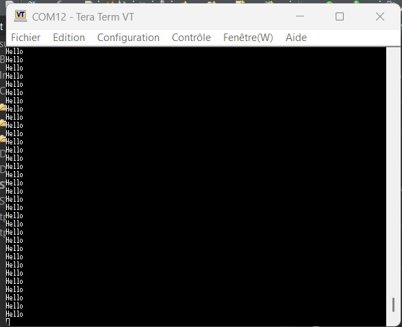


  ### 1.5 Configuration de FreeRTOS

Le système **FreeRTOS** a été activé en mode **CMSIS_V1** dans STM32CubeIDE.  
Cette configuration permet de gérer les tâches du projet via un ordonnanceur temps réel.

Les captures ci-dessous montrent :

- l’activation de FreeRTOS avec l’option **USE_NEWLIB_REENTRANT** (Newlib réentrante) ;
- l’utilisation de **TIM7** comme source de timebase pour le tick système.

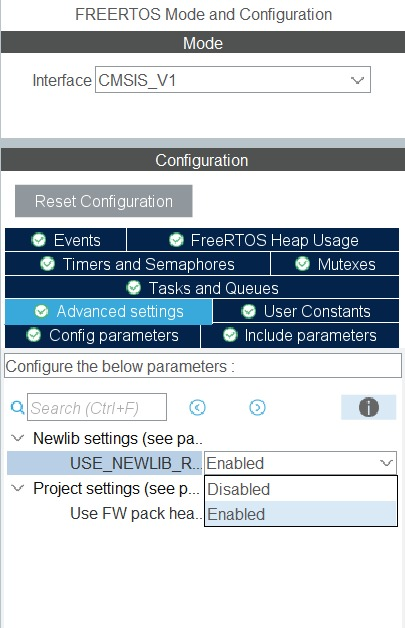

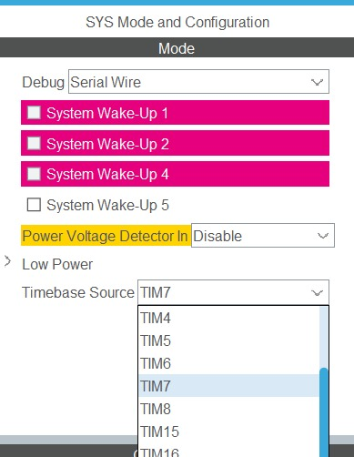

### 1.6 Fonctionnement du shell

Un **shell série** a été mis en place afin de permettre une interaction directe avec la carte via le terminal série.

***(a) Dans une tâche***
Une tâche FreeRTOS qui gère le shell.

```c
//creation de la tache 
if (xTaskCreate(ShellTask,"shell", 256, NULL,1, &h_shell_task)!=pdPASS)
	{
		printf("error creation task shell\r\n");
		Error_Handler();
	}
//la tache 
void ShellTask(void  * argument)
{

	shell_init();
	shell_run();

}
```


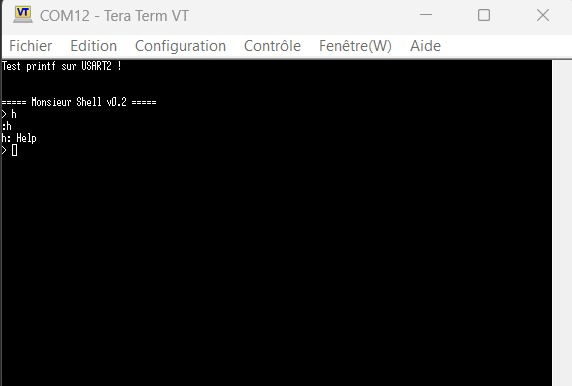
***(b) En mode interruption***

Le shell fonctionne en mode interruption : l’ISR UART signale à la tâche shell via un sémaphore dès qu’un caractère est reçu, permettant un traitement des commandes en temps réel sans bloquer le microcontrôleur.
```c
void HAL_UART_RxCpltCallback(UART_HandleTypeDef *huart)
{
	if (huart->Instance == USART2)
	{
		BaseType_t xHigherPriorityTaskWoken = pdFALSE;


		xSemaphoreGiveFromISR(uartRxSemaphore, &xHigherPriorityTaskWoken);
		HAL_UART_Receive_IT(&huart2, &rxbuffer, 1);

		portYIELD_FROM_ISR(xHigherPriorityTaskWoken);
	}
}
```
Dans le main, on crée le sémaphore: 
```
uartRxSemaphore = xSemaphoreCreateBinary();
	if (uartRxSemaphore == NULL)
	{
	    Error_Handler();
	}
```

***(c) Avec un driver sous forme de structure.***
```c
#include "shell.h"
#include <stdio.h>

static int sh_help(h_shell_t * h_shell, int argc, char ** argv) {
	int i;
	for(i = 0 ; i < h_shell->func_list_size ; i++) {
		int size;
		size = snprintf (h_shell->print_buffer, BUFFER_SIZE, "%c: %s\r\n", h_shell->func_list[i].c, h_shell->func_list[i].description);
		h_shell->drv.transmit(h_shell->print_buffer, size);
	}

	return 0;
}

void shell_init(h_shell_t * h_shell) {
	int size = 0;

	h_shell->func_list_size = 0;

	size = snprintf (h_shell->print_buffer, BUFFER_SIZE, "\r\n\r\n===== Monsieur Shell v0.2 =====\r\n");
	h_shell->drv.transmit(h_shell->print_buffer, size);

	size = snprintf (h_shell->print_buffer, BUFFER_SIZE, "TP Synthèse Audio \r\n");
	h_shell->drv.transmit(h_shell->print_buffer, size);
	shell_add(h_shell, 'h', sh_help, "Help");
}

int shell_add(h_shell_t * h_shell, char c, shell_func_pointer_t pfunc, char * description) {
	if (h_shell->func_list_size < SHELL_FUNC_LIST_MAX_SIZE) {
		h_shell->func_list[h_shell->func_list_size].c = c;
		h_shell->func_list[h_shell->func_list_size].func = pfunc;
		h_shell->func_list[h_shell->func_list_size].description = description;
		h_shell->func_list_size++;
		return 0;
	}

	return -1;
}

static int shell_exec(h_shell_t * h_shell, char * buf) {
	int i;

	char c = buf[0];

	int argc;
	char * argv[ARGC_MAX];
	char *p;

	for(i = 0 ; i < h_shell->func_list_size ; i++) {
		if (h_shell->func_list[i].c == c) {
			argc = 1;
			argv[0] = buf;

			for(p = buf ; *p != '\0' && argc < ARGC_MAX ; p++){
				if(*p == ' ') {
					*p = '\0';
					argv[argc++] = p+1;
				}
			}

			return h_shell->func_list[i].func(h_shell, argc, argv);
		}
	}

	int size;
	size = snprintf (h_shell->print_buffer, BUFFER_SIZE, "%c: no such command\r\n", c);
	h_shell->drv.transmit(h_shell->print_buffer, size);
	return -1;
}

static const char backspace[] = "\b \b";
static const char prompt[] = "> ";

int shell_run(h_shell_t * h_shell) {
	int reading = 0;
	int pos = 0;

	while (1) {
		h_shell->drv.transmit(prompt, 2);
		reading = 1;

		while(reading) {
			char c;
			h_shell->drv.receive(&c, 1);
			int size;

			switch (c) {
			//process RETURN key
			case '\r':
				//case '\n':
				size = snprintf (h_shell->print_buffer, BUFFER_SIZE, "\r\n");
				h_shell->drv.transmit(h_shell->print_buffer, size);
				h_shell->cmd_buffer[pos++] = 0;     //add \0 char at end of string
				size = snprintf (h_shell->print_buffer, BUFFER_SIZE, ":%s\r\n", h_shell->cmd_buffer);
				h_shell->drv.transmit(h_shell->print_buffer, size);
				reading = 0;        //exit read loop
				pos = 0;            //reset buffer
				break;
				//backspace
			case '\b':
				if (pos > 0) {      //is there a char to delete?
					pos--;          //remove it in buffer

					h_shell->drv.transmit(backspace, 3);	// delete the char on the terminal
				}
				break;
				//other characters
			default:
				//only store characters if buffer has space
				if (pos < BUFFER_SIZE) {
					h_shell->drv.transmit(&c, 1);
					h_shell->cmd_buffer[pos++] = c; //store
				}
			}
		}
		shell_exec(h_shell, h_shell->cmd_buffer);
	}
	return 0;
}
```

 
---
## 2 – Le GPIO Expander et le VU-Mètre

### 2.1.1 Réference du GPIO Expander

Le VU-mètre du TP est piloté à l’aide d’un **GPIO Expander** dont la référence est :

le MCP23S17-E/S0. Ce périphérique communique avec le microcontrôleur via une interface SPI
et fournit 16 broches GPIO configurables comme entrées ou sorties.

#### 2.2.2 SPI utilisé

Nous avons utilisé le SPI3

#### 2.2.3 Les paramètres à configurer 
- D'après la documentation du MCP23S17, ce circuit supporte une fréquence d'horloge SPI maximale de 10 MHz.
- On a définit la taille des données (data size) à 8 bits, conformément au protocole de communication SPI.
- On a choisit le mode software pour le type de signal NSS (NSS Signal Type).
- - On a mappé les signaux SPI sur les broches du STM32:
- **SPI3_MOSI** (Master Out Slave In)  → **PB5**  
- **SPI3_MISO** (Master In Slave Out) → **PC11**  
- **SPI3_SCK** (Serial Clock)         → **PC10**  
- **SPI3_/CS** (Chip Select)          → **PB7**  
- **/RESET** du MCP23S17              → **PA0**
  
#### 2.2.4 Configuration


### 2.2 Tests

Le MCP23S17 pilote deux réseaux de LEDs connectés respectivement sur ses ports **GPIOA** et **GPIOB**.  
Ces LEDs s’activent à l’état bas (logique inversée).


---

#### 2.2.1 Clignotement des Leds:
```c
void Blink_All_LEDs(void) {
	while (1) {
		write_MCP23017(0x13, 0xFF);
		HAL_Delay(500);
		write_MCP23017(0x13, 0x00);
		HAL_Delay(500);
	}
}
```


#### 2.2.2 Chenillard

``` c
void LED_Chenillard(void) {
	for (uint8_t i = 0; i < 8; i++) {
		write_MCP23017(0x13, ~(1 << i));
		write_MCP23017(0x12, ~(1 << i));
		HAL_Delay(200);
	}

}
```


### 2.3 Création d'un Driver pour Piloter les LEDs
#### 2.3.1 Clignotement des Leds avec structure:

Dans cette partie du TP, nous avons créé un driver pour piloter les LEDs connectées au GPIO Expander MCP23S17 en utilisant une structure LED_Driver_t. La structure LED_Driver_t contient des pointeurs vers plusieurs fonctions liées aux LEDs. Ces fonctions incluent l'initialisation du MCP23S17 (init), l'écriture dans les registres (write), le contrôle d'une LED spécifique (test_first_led), le chenillard (chenillard), et le clignotement de toutes les LEDs (blink_all).

``` c
/*
 * led.c
 *
 *  Created on: Nov 21, 2025
 *      Author: maram
 */
#include"led.h"
#include <stdint.h>
#include "main.h"
#include "shell.h"
#include <string.h>
#include <stdio.h>
#include <stdlib.h>
extern SPI_HandleTypeDef hspi3;
extern LED_Driver_t led_driver;

void write_MCP23017(uint8_t registre, uint8_t value)
{
	uint8_t commande[3];
	commande[0]=0x40; //
	commande[1]=registre;
	commande[2]=value;

	HAL_GPIO_WritePin(GPIOA, VU_nRESET_Pin, GPIO_PIN_SET);
	HAL_GPIO_WritePin(GPIOB, VU_nCS_Pin, GPIO_PIN_RESET); //SC=0 pour l'envoie
	HAL_SPI_Transmit(&hspi3, commande, 3, HAL_MAX_DELAY);
	HAL_Delay(10);
	HAL_GPIO_WritePin(GPIOB,VU_nCS_Pin, GPIO_PIN_SET);


}

uint8_t read_MCP23S17(uint8_t reg) {
	uint8_t data[3];
	uint8_t rxData[1];

	data[0] = 0x41;
	data[1] = reg;
	data[2] = 0x00;

	HAL_GPIO_WritePin(GPIOB, VU_nCS_Pin, GPIO_PIN_RESET);
	HAL_SPI_TransmitReceive(&hspi3, data, data, 3, HAL_MAX_DELAY);
	HAL_GPIO_WritePin(GPIOB, VU_nCS_Pin, GPIO_PIN_SET);

	return data[2];
}

void init_MCP23017(void)
{
	write_MCP23017(0x00,0x00); // les oins A en sortie
	write_MCP23017(0x01,0x00); // les pins B en sortie
	write_MCP23017(0x12,0xFF);
	write_MCP23017(0x13,0x0FF);


}
void Test_First_LED(void) {
	write_MCP23017(0x13, 0xFE);
	write_MCP23017(0x12, 0xFE);
}
void Blink_All_LEDs(void) {
	while (1) {
		write_MCP23017(0x13, 0xFF);
		HAL_Delay(500);
		write_MCP23017(0x13, 0x00);
		HAL_Delay(500);
	}
}


void LED_Chenillard(void) {
	for (uint8_t i = 0; i < 8; i++) {
		write_MCP23017(0x13, ~(1 << i));
		write_MCP23017(0x12, ~(1 << i));
		HAL_Delay(200);
	}

}
void LED_Driver_Init(LED_Driver_t *driver) {

	driver->init = init_MCP23017;
	driver->write = write_MCP23017;
	driver->read = read_MCP23S17;
	driver->test_first_led = Test_First_LED;
	driver->chenillard = LED_Chenillard;
	driver->blink_all = Blink_All_LEDs;


	driver->init();
}

/*
 * led.h
 *
 *  Created on: Nov 21, 2025
 *      Author: maram
 */

#ifndef INC_LED_H_
#define INC_LED_H_

#include <stdint.h>
#include "shell.h"


typedef struct {
    void (*init)(void);
    void (*write)(uint8_t reg, uint8_t value);
    void (*test_first_led)(void);
    void (*chenillard)(void);
    void (*blink_all)(void);
    uint8_t (*read)(uint8_t reg);
} LED_Driver_t;


void write_MCP23017(uint8_t reg, uint8_t value);
void init_MCP23017(void);
void Test_First_LED(void);
void Blink_All_LEDs(void);
void LED_Chenillard(void);
void LED_Driver_Init(LED_Driver_t *driver);
#endif /* INC_LED_H_ */

``` 
Le driver a été initialisé en appelant la fonction LED_Driver_Init(), qui associe chaque fonction du driver à un pointeur de fonction dans la structure LED_Driver_t.
``` c
while(1){

LED_Driver_Init(&led_driver);
led_driver.blink_all();
  }
```


### 2.3.2 Écriture d’une fonction shell permettant d’allumer ou d’éteindre n’importe quelle LED

Une fonction shell a été créée dans leds.c pour allumer ou éteindre une LED sur le périphérique GPIO Expander MCP23S17 via une commande shell.

La fonction shell_control_led permet de contrôler l’état des LEDs en fonction des arguments passés à la commande. Elle attend une commande au format suivant : 
l <port> <pin> <state> 
avec:
port : Port sur lequel la LED est connectée ('A' pour le port A, 'B' pour le port B).

pin : Numéro de la LED (valeurs possibles de 0 à 7).

state : État de la LED (1 pour allumer, 0 pour éteindre)

``` c

int shell_control_led(h_shell_t *h_shell, int argc, char **argv) {

	if (argc != 4) {
		snprintf(h_shell->print_buffer, BUFFER_SIZE, "Usage: l <port> <pin> <state>\r\n");
		h_shell->drv.transmit(h_shell->print_buffer, strlen(h_shell->print_buffer));
		return -1;
	}


	char port = argv[1][0];
	int pin = atoi(argv[2]);
	int state = atoi(argv[3]);


	if ((port != 'A' && port != 'B') || pin < 0 || pin > 7 || (state != 0 && state != 1)) {
		snprintf(h_shell->print_buffer, BUFFER_SIZE, "Invalid arguments\r\n");
		h_shell->drv.transmit(h_shell->print_buffer, strlen(h_shell->print_buffer));
		return -1;
	}


	uint8_t reg = (port == 'A') ? 0x13 : 0x12;
	uint8_t current_state = 0;


	if (led_driver.read) {
		current_state = led_driver.read(reg);
	}


	if (state == 1) {
		current_state &= ~(1 << pin);
	} else {
		current_state |= (1 << pin);
	}

	led_driver.write(reg, current_state);

	// Retourner un message de confirmation
	snprintf(h_shell->print_buffer, BUFFER_SIZE, "LED %c%d %s\r\n", port, pin, state ? "ON" : "OFF");
	h_shell->drv.transmit(h_shell->print_buffer, strlen(h_shell->print_buffer));

	return 0;
}

```
``` c
void init_shell(void *unused)
{
	h_shell.drv.receive = drv_uart2_receive;
	h_shell.drv.transmit = drv_uart2_transmit;

	shell_init(&h_shell);
	shell_add(&h_shell, 'l', shell_control_led, "Control LEDs: l <port> <pin> <state>");

	const char *startup_msg = "\r\nType commands:\r\n";
	h_shell.drv.transmit(startup_msg, strlen(startup_msg));
}
```

``` c
void init_shell(void *unused)
{
	h_shell.drv.receive = drv_uart2_receive;
	h_shell.drv.transmit = drv_uart2_transmit;

	shell_init(&h_shell);
	shell_add(&h_shell, 'l', shell_control_led, "Control LEDs: l <port> <pin> <state>");

	const char *startup_msg = "\r\nType commands:\r\n";
	h_shell.drv.transmit(startup_msg, strlen(startup_msg));
}


void Task_control_Led(void *argument)
{

	LED_Driver_Init(&led_driver);
	init_shell(NULL);
	shell_run(&h_shell);
}
```
Puis nous avons créé une tache qui appelle cette fonction : 

``` c
xTaskCreate(Task_control_Led,"Task_control_led", 256, NULL, 2, NULL);
```
 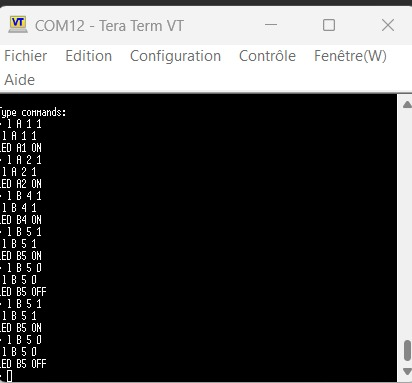

Pour envoyer une commande, on tape par exemple: 
```css

l A 1 1

```
Cela allume la LED sur le port A, pin 2, et affiche:

```vbnet

LED A1 ON

```

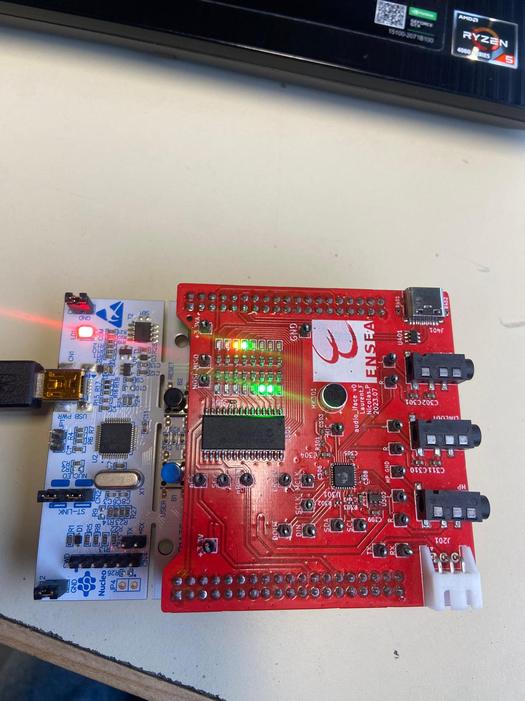

### 3. Le CODEC Audio SGTL5000

### 3.1 Configurations préalables

Le CODEC **SGTL5000** nécessite une interface I²C pour sa configuration.  
Les lignes utilisées pour l’I²C sur la carte NUCLEO-L476RG sont les suivantes :

- **I2C_SCL : PB10**  
- **I2C_SDA : PB11**

Ces deux broches correspondent à l’interface **I2C2** du STM32L476RG.
 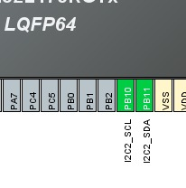
### 3.1.2 Activation de l’I2C

Le périphérique **I2C** a été activé en laissant la configuration par défaut.  

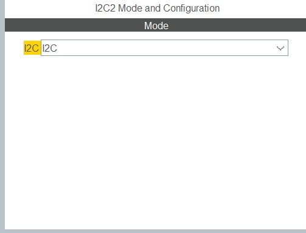

### 3.1.3 Configuration du SAI2 

Le bloc **SAI A** a été configuré en mode **Master with Master Clock Out** afin de générer le signal d’horloge MCLK nécessaire au CODEC.  
Le protocole **I2S/PCM** a été activé avec une taille de données de **16 bits**.
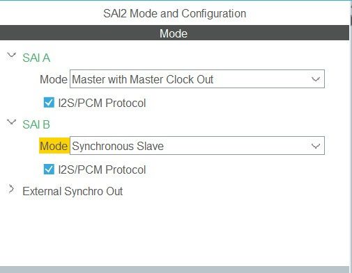

### 3.1.4 Mapping des broches du SAI2

Les signaux sont connectés comme suit :

- **PB12 → SAI2_FS_A**
- **PB13 → SAI2_SCK_A**
- **PB14 → SAI2_MCLK_A**
- **PB15 → SAI2_SD_A**
- **PC12 → SAI2_SD_B**

Cette configuration assure une communication correcte entre le STM32 et le CODEC audio SGTL5000.

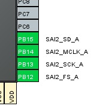

 ### 3.1.5 Configuration de l’horloge du SAI2 (PLLSAI1)

Dans l’onglet **Clock Configuration**  le **PLLSAI1** a été configuré afin d’obtenir une fréquence de **12.235294 MHz** pour le périphérique **SAI2**, conformément à l’énoncé du TP.

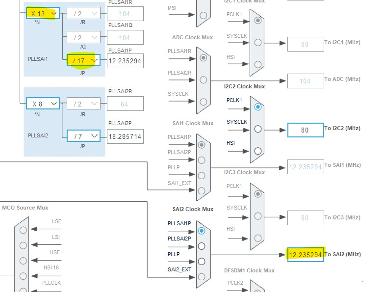


### 3.1.6 Configuration détaillée des blocs SAI A et SAI B

Le bloc **SAI A** a été configuré en mode **Master Transmit** avec génération d’horloge (MCLK), en utilisant le protocole **I2S Standard** et une taille de données de **16 bits**.

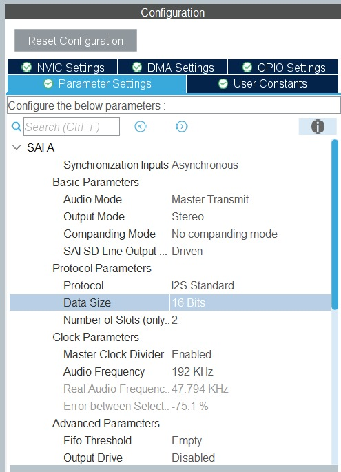

Le bloc **SAI B** a été configuré en mode **Slave Receive**, synchronisé avec le bloc SAI A, tout en conservant le protocole **I2S Standard** et une taille de données de **16 bits**.


### 3.1.7 Activation des interruptions du SAI2

Les interruptions du périphérique **SAI2** ont été activées.  
Cela permet au microcontrôleur de gérer les événements liés au transfert des données audio (transmission et réception via DMA).

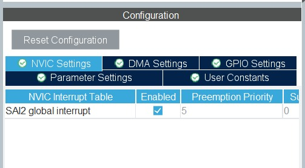

### 3.1.8 Configuration du DMA pour le SAI2

Le **DMA** a été configuré pour les deux blocs du SAI2 afin de permettre le transfert continu des données audio :

- **SAI2_A → DMA1 Channel 6**
- **SAI2_B → DMA1 Channel 7**
- Mode de fonctionnement : **Circulaire**

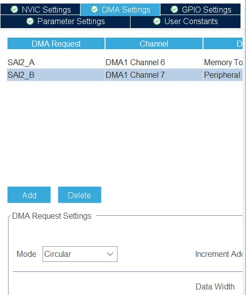

### 3.1.9 Activation manuelle de l’horloge MCLK

Avant toute tentative de communication avec le CODEC SGTL5000, l’horloge **MCLK** doit être activée.  
Cette horloge est générée par le bloc **SAI A**.

Pour cela, la ligne suivante a été ajoutée dans la fonction `main()`, juste après l’initialisation des périphériques :

```c
__HAL_SAI_ENABLE(&hsai_BlockA2);
```
### 3.2  Configuration du CODEC par l’I2C
### 3.2.1 Vérification du signal MCLK à l’oscilloscope

À l’aide d’un oscilloscope, la présence du signal **MCLK** généré par le bloc **SAI2** a été vérifiée.

La mesure indique une fréquence d’environ **12.3 MHz**, ce qui correspond à la valeur attendue (**12.235294 MHz**).  
Cela confirme que la configuration du **PLLSAI1** et du **SAI2** est correcte.


### 3.2.2 Lecture du registre CHIP_ID par I2C

La fonction `HAL_I2C_Mem_Read()` a été utilisée pour lire le contenu du registre **CHIP_ID** situé à l’adresse **0x0000** du CODEC **SGTL5000**.  
L’adresse I2C utilisée pour le périphérique est **0x14**.
``` c

void task_read_CHIP_ID(void *unused) {
	uint8_t SGTL5000_I2C_ADDR = 0x14;
	uint8_t CHIP_ID_Value[2];
	uint16_t CHIP_ID_Reg = 0x0000;
	while(1){
		HAL_StatusTypeDef status = HAL_I2C_Mem_Read(&hi2c2, SGTL5000_I2C_ADDR,
				CHIP_ID_Reg, I2C_MEMADD_SIZE_16BIT,
				CHIP_ID_Value, 2, 1000);

		if (status == HAL_OK) {
			printf("CHIP_ID = 0x%02X%02X\n", CHIP_ID_Value[0], CHIP_ID_Value[1]);
		} else {
			printf("Erreur de lecture CHIP_ID : %d\n", status);
		}
		HAL_Delay(500);
	}
}

```
Puis nous avons créé une tache qui appelle cette fonction : 

``` c
//xTaskCreate(task_read_CHIP_ID, "Read_CHIP_ID", 256, NULL, 3, NULL);
```
La valeur lue correspond à **0x0001**, ce qui confirme que la communication **I2C fonctionne correctement** entre le STM32 et le CODEC.

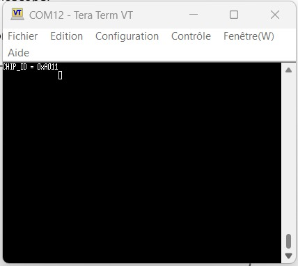

### 3.2.3 Observation des trames I2C à l’oscilloscope

Les trames **I2C** ont été observées directement à l’oscilloscope sur les lignes **SCL/SDA** lors de la communication entre le STM32 et le CODEC **SGTL5000**.
### 3.2.4 Le professeur à vérifié les siganux.


### 3.2.5 Valeurs des registres du CODEC SGTL5000

À partir de la documentation officielle du **SGTL5000**, les valeurs suivantes ont été identifiées afin de configurer correctement le CODEC audio :

- **CHIP_ANA_POWER** : `0x6AFF`  
- **CHIP_LINREG_CTRL** : `0x006C`  
- **CHIP_REF_CTRL** : `0x004E`  
- **CHIP_LINE_OUT_CTRL** : `0x0322`  
- **CHIP_SHORT_CTRL** : `0x1106`  
- **CHIP_ANA_CTRL** : `0x0133`  
- **CHIP_DIG_POWER** : `0x0073`  
- **CHIP_LINE_OUT_VOL** : `0x0505`  
- **CHIP_CLK_CTRL** : `0x0002`  
- **CHIP_I2S_CTRL** : `0x0001`  
- **CHIP_ADCDAC_CTRL** : `0x000C`  
- **CHIP_DAC_VOL** : `0x3C3C`

Ces valeurs seront utilisées dans la fonction d’initialisation du CODEC afin d’activer l’ensemble des blocs analogiques et numériques nécessaires à la conversion audio.

###3.2.6 Création des fichiers sgtl5000.c et sgtl5000.h

Deux fichiers ont été ajoutés afin de structurer le driver du CODEC :

c
/Core/Src/sgtl5000.c
/Core/Inc/sgtl5000.h


### 3.2.7 Fonction d’initialisation du CODEC

Dans sgtl5000.c, nous avons créé une fonction dédiée
```c
HAL_StatusTypeDef sgtl5000_init(h_sgtl5000_t * h_sgtl5000)
{
	HAL_StatusTypeDef ret = HAL_OK;
	uint16_t mask;

	mask = 0x6AFF;
	sgtl5000_i2c_write_register(h_sgtl5000, SGTL5000_CHIP_ANA_POWER, mask);

	mask = (1 << 5) | (1 << 6);
	sgtl5000_i2c_set_bit(h_sgtl5000, SGTL5000_CHIP_LINREG_CTRL, mask);

	mask = 0x01FF;	// VAG_VAL = 1.575V, BIAS_CTRL = -50%, SMALL_POP = 1
	sgtl5000_i2c_write_register(h_sgtl5000, SGTL5000_CHIP_REF_CTRL, mask);

	mask = 0x031E;
	sgtl5000_i2c_write_register(h_sgtl5000, SGTL5000_CHIP_LINE_OUT_CTRL, mask);

	mask = 0x1106;	// MODE_CM = 2, MODE_LR = 1, LVLADJC = 200mA, LVLADJL = 75mA, LVLADJR = 50mA
	sgtl5000_i2c_write_register(h_sgtl5000, SGTL5000_CHIP_SHORT_CTRL, mask);

	mask = 0x0004;	// Unmute all + SELECT_ADC = LINEIN
	//	mask = 0x0000;	// Unmute all + SELECT_ADC = MIC
	sgtl5000_i2c_write_register(h_sgtl5000, SGTL5000_CHIP_ANA_CTRL, mask);

	mask = 0x6AFF;	// LINEOUT_POWERUP, ADC_POWERUP, CAPLESS_HEADPHONE_POWERUP, DAC_POWERUP, HEADPHONE_POWERUP, REFTOP_POWERUP, ADC_MONO = stereo
	sgtl5000_i2c_write_register(h_sgtl5000, SGTL5000_CHIP_ANA_POWER, mask);
	
	mask = 0x0073;	// I2S_IN_POWERUP, I2S_OUT_POWERUP, DAP_POWERUP, DAC_POWERUP, ADC_POWERUP
	sgtl5000_i2c_write_register(h_sgtl5000, SGTL5000_CHIP_DIG_POWER, mask);

	mask =  0x0505;	// TODOo recalculer
	sgtl5000_i2c_write_register(h_sgtl5000, SGTL5000_CHIP_LINE_OUT_VOL, mask);

	mask = 0x0004;	// SYS_FS = 48kHz
	sgtl5000_i2c_write_register(h_sgtl5000, SGTL5000_CHIP_CLK_CTRL, mask);

	mask = 0x0130;	// DLEN = 16 bits
	sgtl5000_i2c_write_register(h_sgtl5000, SGTL5000_CHIP_I2S_CTRL, mask);

	mask = 0x0010;	// DAC_SELECT = I2S_IN
	sgtl5000_i2c_write_register(h_sgtl5000, SGTL5000_CHIP_SSS_CTRL, mask);

	/* Le reste */
	mask = 0x0000;	// Unmute
	sgtl5000_i2c_write_register(h_sgtl5000, SGTL5000_CHIP_ADCDAC_CTRL, mask);

	mask = 0x3C3C;
	//	mask = 0x4747;
	sgtl5000_i2c_write_register(h_sgtl5000, SGTL5000_CHIP_DAC_VOL, mask);

	mask = 0x0251;	// BIAS_RESISTOR = 2, BIAS_VOLT = 5, GAIN = 1
	sgtl5000_i2c_write_register(h_sgtl5000, SGTL5000_CHIP_MIC_CTRL, mask);


	return ret;
}
```

#### 3.2.8 Initialisation du SGTL5000
``` c
void sgtl5000Init(void)
{
	sgtl5000_handle.hi2c = &h_i2c2;
	sgtl5000_handle.i2c_address = 0x14;

	HAL_StatusTypeDef ret = sgtl5000_init(&sgtl5000_handle);
	if (ret == HAL_OK) {
		printf("SGTL5000 initialized successfully!\r\n");
		HAL_Delay(100);
	} else {
		printf("SGTL5000 initialization failed. Error: %d\r\n", ret);
	}
}
```

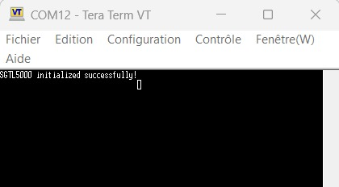

Le CODEC est donc configuré et opérationnel.

---

## 3.3 Signaux I²S

### 3.3.1 Activation du flux audio avec DMA

Pour permettre l’échange continu des données audio, deux buffers I²S ont été créés :

```c
uint16_t txBuffer[BUFF_SIZE]; // Buffer de transmission SAI
uint16_t rxBuffer[BUFF_SIZE]; // Buffer de réception SAI
```
Ils permettent :

- la réception des échantillons audio,
- la transmission vers le DAC,
```c
HAL_SAI_Transmit_DMA(&hsai_BlockA2, (uint8_t*)audio_tx_buffer, AUDIO_BUFFER_SIZE * 2);
HAL_SAI_Receive_DMA(&hsai_BlockB2, (uint8_t*)audio_rx_buffer, AUDIO_BUFFER_SIZE * 2);
```
---

### 3.3.2 Observation des signaux I²S à l’oscilloscope


- **MCLK** — Master Clock
  
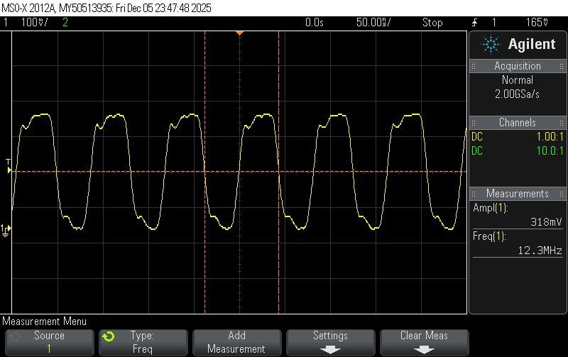
  
- **SCK** — Serial Clock  
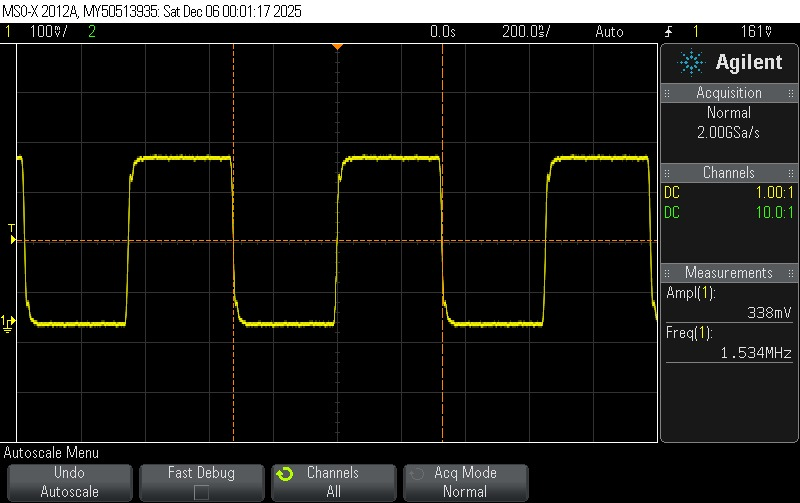


### 3.4 Génération de signal audio

Dans cette étape, un **signal triangulaire** a été généré et envoyé vers la sortie audio du CODEC SGTL5000 afin de vérifier le bon fonctionnement de la chaîne complète.

#### 3.4.1 Création du signal triangulaire

```c

#define AUDIO_BLOCK_SIZE 24
#define AUDIO_BUFFER_SIZE (AUDIO_BLOCK_SIZE * 4)

// Defines for triangular wave generation
#define SAMPLE_RATE_HZ 48000
#define TRIANGLE_TEST_FREQ_HZ 440
#define TRIANGLE_MAX_AMPLITUDE 15000
#define TRIANGLE_STEP ((2 * TRIANGLE_MAX_AMPLITUDE) / (SAMPLE_RATE_HZ / TRIANGLE_TEST_FREQ_HZ))

uint16_t audio_tx_buffer[AUDIO_BUFFER_SIZE];
uint16_t audio_rx_buffer[AUDIO_BUFFER_SIZE];

// Global variables for triangle wave generation
int16_t triangle_current_value = 0;
int8_t triangle_direction = 1; 
void HAL_SAI_TxHalfCpltCallback(SAI_HandleTypeDef *hsai)
{
	if (hsai->Instance == SAI2_Block_A)
	{

		for (int i = 0; i < AUDIO_BLOCK_SIZE; i++) {
			// Generate triangle wave for current sample
			triangle_current_value += triangle_direction * TRIANGLE_STEP;

			if (triangle_current_value >= TRIANGLE_MAX_AMPLITUDE) {
				triangle_current_value = TRIANGLE_MAX_AMPLITUDE;
				triangle_direction = -1;
			} else if (triangle_current_value <= -TRIANGLE_MAX_AMPLITUDE) {
				triangle_current_value = -TRIANGLE_MAX_AMPLITUDE;
				triangle_direction = 1;
			}
			uint16_t output_sample = (uint16_t)triangle_current_value;

			// Fill both left and right channels with the same sample
			audio_tx_buffer[(2 * i)] = output_sample;     // Left Channel
			audio_tx_buffer[(2 * i) + 1] = output_sample; // Right Channel
		}
	}
}

void HAL_SAI_TxCpltCallback(SAI_HandleTypeDef *hsai)
{
	if (hsai->Instance == SAI2_Block_A)
	{

		for (int i = 0; i < AUDIO_BLOCK_SIZE; i++) {
			// Generate triangle wave for current sample
			triangle_current_value += triangle_direction * TRIANGLE_STEP;

			if (triangle_current_value >= TRIANGLE_MAX_AMPLITUDE) {
				triangle_current_value = TRIANGLE_MAX_AMPLITUDE; // Cap at max
				triangle_direction = -1; // Change direction to falling
			} else if (triangle_current_value <= -TRIANGLE_MAX_AMPLITUDE) {
				triangle_current_value = -TRIANGLE_MAX_AMPLITUDE; // Cap at min
				triangle_direction = 1; // Change direction to rising
			}

			uint16_t output_sample = (uint16_t)triangle_current_value;

			// Fill both left and right channels with the same sample
			audio_tx_buffer[AUDIO_BLOCK_SIZE * 2 + (2 * i)] = output_sample;     // Left Channel
			audio_tx_buffer[AUDIO_BLOCK_SIZE * 2 + (2 * i) + 1] = output_sample; // Right Channel
		}
	}
}

```

#### 3.4.2 Observation à l’oscilloscope

La sortie LINE-OUT du CODEC a été observée à l’oscilloscope, où un signal triangulaire stable a été clairement visualisé.

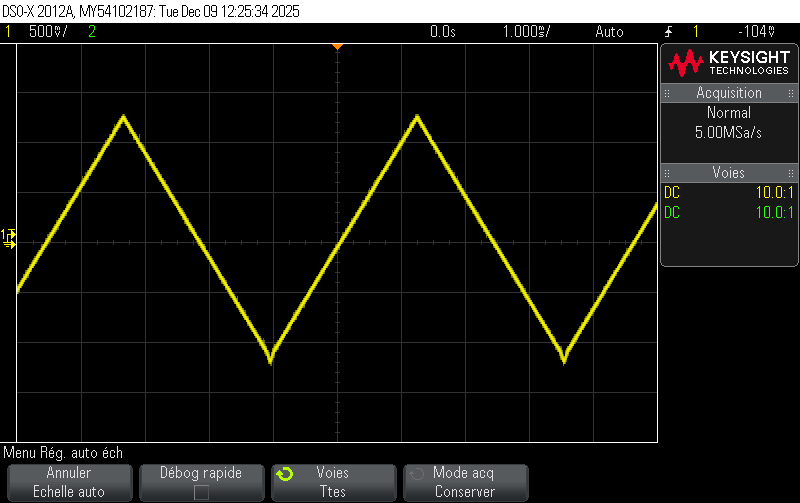


### 3.5 Bypass numérique 

```c
void HAL_SAI_RxHalfCpltCallback(SAI_HandleTypeDef *hsai)
{
  if (hsai->Instance == SAI2_Block_B)
  {
    for (int i = 0; i < AUDIO_BLOCK_SIZE * 2; i++) {
        audio_tx_buffer[i] = audio_rx_buffer[i];
    }
  }
}

void HAL_SAI_RxCpltCallback(SAI_HandleTypeDef *hsai)
{
  if (hsai->Instance == SAI2_Block_B)
  {
    for (int i = 0; i < AUDIO_BLOCK_SIZE * 2; i++) {
        audio_tx_buffer[AUDIO_BLOCK_SIZE * 2 + i] = audio_rx_buffer[AUDIO_BLOCK_SIZE * 2 + i];
    }
  }
}
```
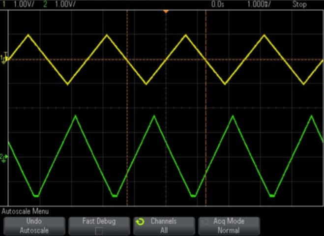

## 5 – Filtre RC
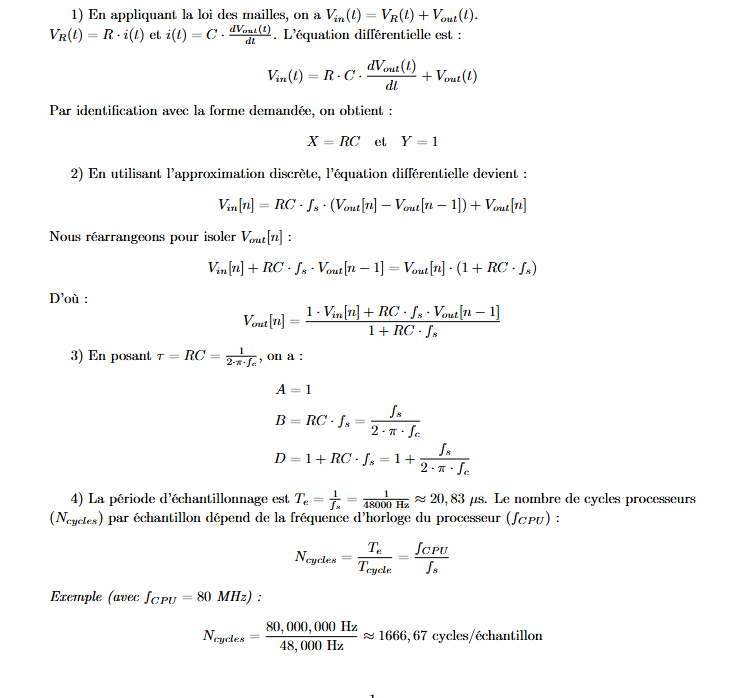


