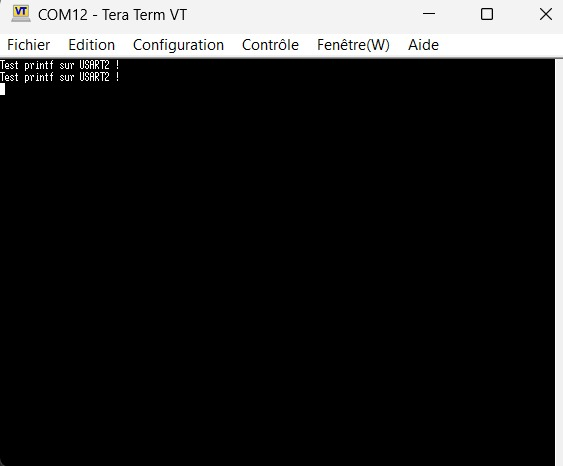
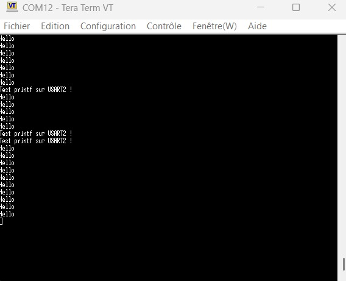
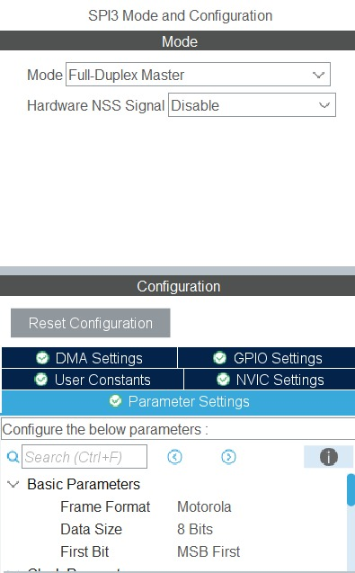
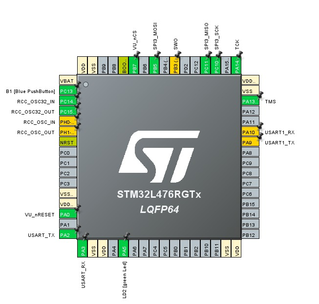

AIT ALLA Hajar  
Bentekfa Maram  

# TP de Synthèse – Autoradio

## 1 – Démarrage

### 1.1 Création du projet pour la carte NUCLEO_L476RG

Un projet a été créé sous **STM32CubeIDE** en sélectionnant la carte **NUCLEO_L476RG**.  
Tous les périphériques ont été initialisés avec leur configuration par défaut, et la BSP n’a pas été activée, conformément aux consignes du TP.

---

### 1.2 Test de la communication USART2 (via ST-Link)

L’interface **USART2** (connectée à la ST-Link interne) a été utilisée pour vérifier la communication entre la carte et le PC via **Tera Term**.

Un message de test a été envoyé depuis la carte :

```c
printf("Test printf sur USART2 !\r\n");
```



### 1.3 Redirection de la fonction printf

Afin de faciliter l’affichage sur le terminal série, la fonction `printf` a été redirigée vers l’USART2 grâce à la fonction suivante :

```c
int __io_putchar(int chr)
{
    HAL_UART_Transmit(&huart2, (uint8_t*)&chr, 1, HAL_MAX_DELAY);
    return chr;
}
```
### 1.4 Activation de FreeRTOS et test avec messages périodiques

Le système d’exploitation temps réel **FreeRTOS** a été activé en mode **CMSIS V1**.  
Une tâche a ensuite été créée afin d’envoyer périodiquement le message **"Hello"** sur l’USART2.

L’affichage répété de ce message dans le terminal série confirme que :




- Les tâches FreeRTOS sont exécutées correctement  
- L’ordonnanceur fonctionne comme prévu
  
### 1.5 Mise en place du Shell

Un **shell série** a été mis en place afin de permettre une interaction directe avec la carte via le terminal série.

Au démarrage, le message suivant est affiché :

===== Monsieur Shell v0.2 =====


Ce message indique que le shell a été correctement initialisé et qu’il est prêt à recevoir des commandes.

### 1.6 Test des commandes du Shell

Une première commande de test a été envoyée dans le terminal :


Le shell a alors répondu :


Ce résultat confirme que :

- Le shell fonctionne correctement  
- Les commandes sont reconnues et traitées  
- Le système est prêt pour l’ajout de nouvelles commandes  

---
## 2 – Le GPIO Expander et le VU-Mètre

### 2.1 Configuration du GPIO Expander

Le VU-mètre du TP est piloté à l’aide d’un **GPIO Expander** dont la référence est :

- **MCP23S17** (expander GPIO 16 bits commandé en SPI)

La communication entre le STM32 et le MCP23S17 se fait via le bus **SPI3** du microcontrôleur.

### 2.2 Configuration du SPI3 dans STM32CubeIDE

#### 2.2.1 Paramètres généraux du SPI

D’après la documentation du **MCP23S17**, la fréquence maximale du bus SPI est de **10 MHz**.  
Nous avons donc configuré le périphérique **SPI3** à 10 MHz dans STM32CubeIDE, comme illustré ci-dessous :



Les paramètres principaux sont les suivants :

- **Fréquence SPI** : 10 MHz  
- **Data size** : 8 bits (conformément au protocole SPI et au MCP23S17)  
- **NSS Signal Type** : gestion en **software** (NSS Software)

#### 2.2.2 Mapping des broches SPI3

Ensuite, il est nécessaire de mapper correctement les signaux SPI3 du STM32 vers le MCP23S17.  
La configuration retenue est la suivante :

- **SPI3_MOSI** (Master Out Slave In)  → **PB5**  
- **SPI3_MISO** (Master In Slave Out) → **PC11**  
- **SPI3_SCK** (Serial Clock)         → **PC10**  
- **SPI3_/CS** (Chip Select)          → **PB7**  
- **/RESET** du MCP23S17              → **PA0**

Cette configuration est visible sur le schéma des broches généré par STM32CubeIDE :



Ces broches ont ensuite été configurées dans l’onglet **GPIO Settings** de STM32CubeIDE afin de garantir une communication correcte entre le STM32L476 et le MCP23S17 pour le pilotage du VU-mètre.
### 2.2 Tests

Le MCP23S17 pilote deux réseaux de LEDs connectés respectivement sur ses ports **GPIOA** et **GPIOB**.  
Ces LEDs s’activent à l’état bas (logique inversée). Les tests incluent :

- Activation alternée d'une LED sur deux  
- Validation du bon fonctionnement via un chenillard  

Les registres utilisés pour configurer et contrôler les LEDs sont présentés en détail ci-dessous.

---

#### 2.2.1 Test d'une LED sur 2

```c
MCP23S17_Init();
while(1){

    // Premiers tests des LEDs sans structure
    //Test_First_LED();
    //Blink_All_LEDs();
    //LED_Chenillard();
    MCP23S17_Write(0x13, 0x55);
}
```


#### 2.2.2 Chenillard

```c
void LED_Chenillard(void) {
    for (uint8_t i = 0; i < 8; i++) {
        MCP23S17_Write(0x13, ~(1 << i));
        MCP23S17_Write(0x12, ~(1 << i));
        HAL_Delay(200);
    }
}


